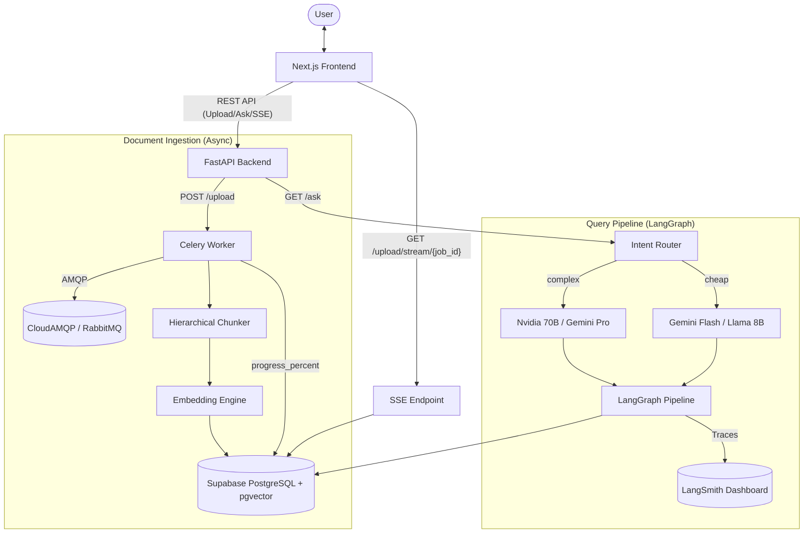

# Project Architecture & Design Overview

This document provides a comprehensive breakdown of the **AI Knowledge Copilot** (`bbygrl` / `thotqen`). It is a production-grade RAG application that lets users upload PDF documents and have intelligent, context-aware conversations with them.

---

## 🏗️ High-Level Architecture



---

## 🛠️ Technology Stack

### 1. Frontend (`bbygrl`)
- **Next.js (React 19)**: Core framework for UI and routing.
- **GSAP**: High-end micro-animations and scroll effects.
- **HTML5 Canvas**: Interactive animal animations reflecting AI state.
- **Tailwind CSS**: Utility-first styling.

### 2. Backend (`thotqen`)
- **FastAPI**: Async Python web framework with SSE support (`sse_starlette`).
- **LangGraph**: Stateful agentic RAG pipeline (see pipeline section below).
- **Celery + RabbitMQ (CloudAMQP)**: Background workers for async PDF ingestion.
- **PyMuPDF (`pymupdf4llm`)**: PDF text and structure extraction.
- **Supabase (PostgreSQL + pgvector + HNSW)**: Stores documents, embeddings, jobs, and chat history.

### 3. AI / ML / Observability
- **Intent Router**: Groq Llama 3.1 8B classifies queries as `cheap` or `complex`.
- **Cheap LLMs**: Gemini 1.5 Flash (`langchain-google-genai`), Llama 3.1 8B (Groq).
- **Complex LLMs**: Nvidia Llama 3.1 70B (`langchain-nvidia-ai-endpoints`), Gemini 1.5 Pro.
- **Embeddings**: `sentence-transformers/all-MiniLM-L6-v2` (local, 384-dim).
- **Reranker**: `cross-encoder/ms-marco-MiniLM-L-6-v2` (local Cross-Encoder).
- **LangSmith**: Production grade LLM observability (traces every step, token usage, and latency).
- **Ragas**: Pro-grade evaluation framework (`scripts/generate_testset.py` & `scripts/run_evals.py`) scoring Context Precision, Context Recall, Answer Relevance, and Faithfulness.

---

## 🔄 Document Ingestion Workflow

1. **Upload**: User sends `POST /upload` with a PDF.
2. **Job Created**: API creates a `document_jobs` row and returns `job_id` instantly.
3. **Queue**: A Celery task is dispatched to CloudAMQP.
4. **SSE Stream**: Client connects to `GET /upload/stream/{job_id}` to receive real-time progress events (0% → 100%).
5. **Hierarchical Chunking**:
   - Large **Parent** chunks (~1500 tokens) — stored for context retrieval.
   - Small **Child** chunks (~300 tokens) — embedded and indexed for precision search.
6. **Embedding**: Child chunks are batch-embedded (32 at a time) and stored in `embeddings` table.
7. **FTS Index**: A PostgreSQL trigger auto-populates a `tsvector` column for BM25 keyword search.
8. **Job Done**: `document_jobs.status` → `done`, `progress_percent` → `100`.

---

## 🤖 Query Pipeline (LangGraph)

Every user question flows through a stateful graph:

```
START
  │
  ▼
[input_guardrail]     ← LLM safety check (prompt injection / toxic)
  │ safe
  ▼
[hyde_generator]      ← Generates hypothetical answer to enrich query embedding
  │
  ▼
[retrieve]            ← Hybrid Search: BM25 + Vector → RRF merge → Parent expansion
  │
  ▼
[rerank_documents]    ← Cross-Encoder reranker, keeps top-5
  │
  ▼
[grade_documents]     ← LLM grades each doc: relevant ("yes") or not ("no")
  │
  ├─ all irrelevant + no web yet → [web_search] → [generate]
  ├─ all irrelevant + web done  → [rewrite_query] → [retrieve]
  └─ some relevant              → [generate]
                                      │
                                      ▼
                               [grade_generation]  ← hallucination + usefulness check
                                      │
                                  ├─ bad  → [rewrite_query]  (max 3 loops)
                                  └─ good → END
```

### Hybrid Search (RRF)
The `hybrid_search` PostgreSQL function combines:
- **Dense retrieval**: HNSW vector similarity (child chunks, 384-dim)
- **Sparse retrieval**: BM25 full-text search (`tsvector`, GIN index)
- **Fusion**: Reciprocal Rank Fusion `score = 1/(k+rank_dense) + 1/(k+rank_fts)`

When a child chunk is retrieved, its **parent chunk** content is returned to the LLM for broader context.

---

## 🧩 Component Map

### Backend Services (`thotqen/app/`)
| File | Role |
|---|---|
| `main.py` | FastAPI app factory, CORS, lifespan hooks |
| `routes.py` | Public endpoints: `/upload`, `/upload/status/{id}`, `/upload/stream/{id}`, `/ask`, `/chat` |
| `cache_routes.py` | Internal endpoints: semantic cache check/write, Cloudflare KV invalidation |
| `core/config.py` | All env vars (Groq, Gemini, Nvidia, DB, Celery, Supabase) |
| `core/auth.py` | JWT auth via `python-jose` |
| `worker/celery_app.py` | Celery factory wired to CloudAMQP |
| `worker/tasks.py` | `ingest_document_task` — runs chunking, embedding, DB writes with progress |
| `services/rag.py` | `ask_question` entry point; Intent Router → `run_rag_graph` |
| `services/langgraph_rag.py` | Full LangGraph pipeline (see above) |
| `services/chunking.py` | `hierarchical_chunk_text` — Parent→Child splitting |
| `services/document_service.py` | `ingest_document` — DB writes for parent/child chunks |
| `services/embeddings.py` | `embed_text` — local sentence-transformers |
| `services/vectorstore.py` | PGVector wrapper (HNSW-backed) |
| `services/history.py` | `PostgresChatMessageHistory` per session |
| `db/database.py` | psycopg3 connection pool |
| `db/init.sql` | Full schema: documents, chunks (parent/child), embeddings, jobs, cache, hybrid_search() |
| `scripts/evaluate_sessions.py` | Offline Ragas eval (answer_relevance, faithfulness) |

---

## 💡 Key Design Decisions

1. **Intent Routing over Manual Selection**: A cheap LLM classifier routes each query to the most cost-efficient capable model, removing the need for the user to pick a model.
2. **Hierarchical Chunking**: Child chunks are indexed for precision; parent chunks are returned to the LLM for rich context — best of both worlds.
3. **Hybrid Search (RRF)**: BM25 catches exact-match keywords (names, codes); vector search catches semantic similarity. RRF fuses both without needing score normalization.
4. **HyDE**: Generating a hypothetical answer before retrieval drastically improves semantic recall for complex or abstract queries.
5. **Async Ingestion with SSE**: Large PDFs are processed in the background; the frontend receives real-time progress via Server-Sent Events instead of polling.
6. **Offline Evals**: Ragas metrics are run on demand via a script, not inline, to keep request latency minimal.
7. **Pro-Grade Observability**: Using LangSmith, the LangGraph execution is fully traced. Every LLM call, API request, token count, and latency metric is logged to a central dashboard.
8. **Live Admin Telemetry**: A custom Next.js frontend page at `/admin` polls `GET /api/admin/metrics` to render live glassmorphism charts of LLM performance.
