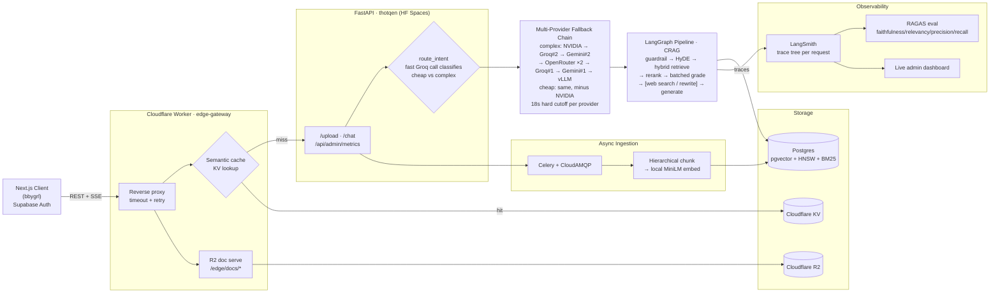
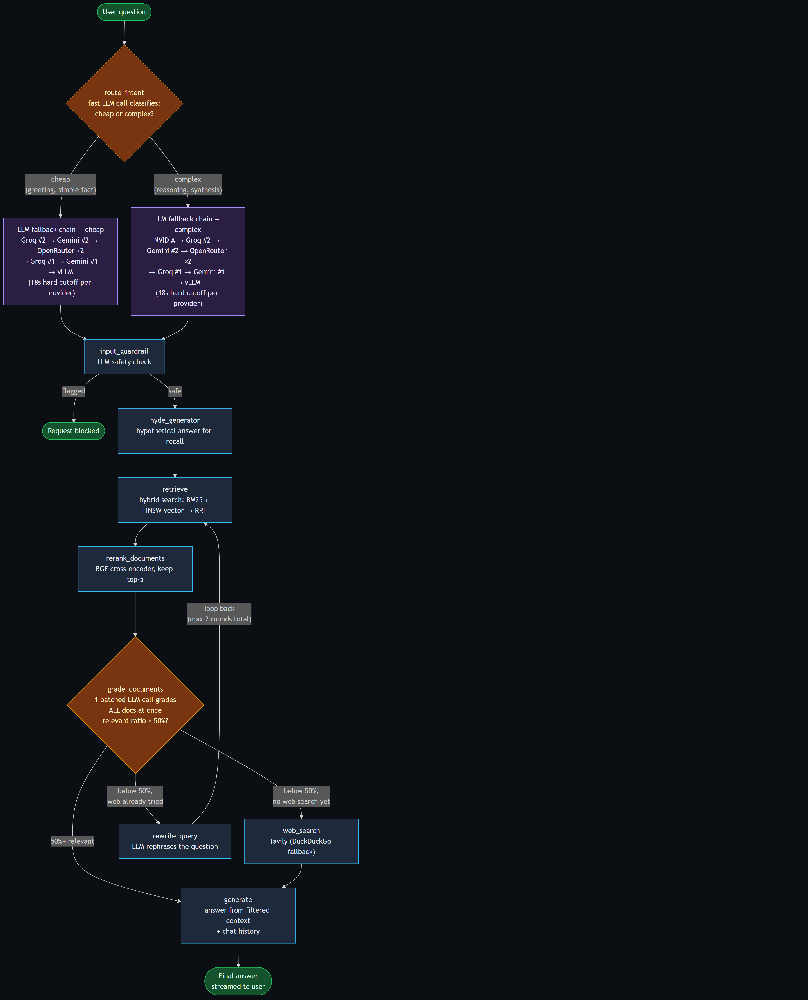
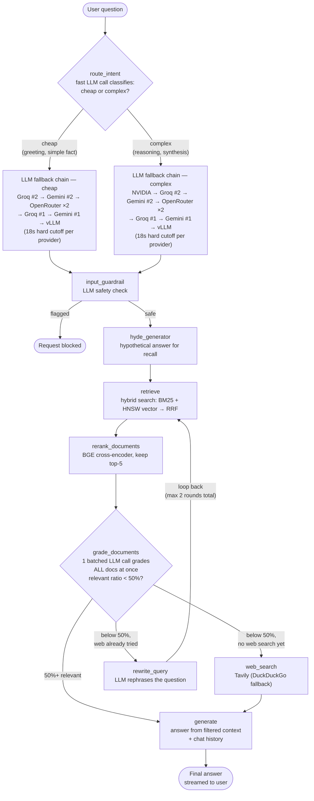

# Project Architecture & Design Overview

This document provides a comprehensive breakdown of the **AI Knowledge Copilot** (`bbygrl` / `thotqen`). It is a production-grade RAG application that lets users upload PDF documents and have intelligent, context-aware conversations with them.

---

## 🏗️ High-Level Architecture

Client → Cloudflare Worker edge gateway (CORS, semantic cache, R2 doc serving, reverse proxy with timeout/retry) → FastAPI backend → intent-routed multi-provider LLM fallback chain → LangGraph CRAG pipeline → Postgres/pgvector + R2 storage, with every request fully traced through LangSmith and scored offline via a RAGAS eval harness.

Mermaid source (editable)

---

## 🛠️ Technology Stack

### 1. Frontend (`bbygrl`)
- **Next.js (React 19)**: Core framework for UI and routing.
- **Supabase Auth**: Anonymous + email sign-in.
- **Tailwind / inline styles**: UI styling.

### 2. Edge (`edge-gateway`, Cloudflare Worker)
- Reverse proxy to the FastAPI origin with explicit timeout + retry handling (502/504 on origin failure instead of an opaque CORS error).
- CORS enforced via an explicit origin allowlist.
- Direct R2 document serving at `/edge/docs/*`, bypassing the origin entirely.
- Semantic cache check/write against Cloudflare KV before hitting the LLM pipeline on `/chat`.

### 3. Backend (`thotqen`)
- **FastAPI**: Async Python web framework with SSE support (`sse_starlette`).
- **LangGraph**: Stateful agentic RAG pipeline (see pipeline section below).
- **Celery + RabbitMQ (CloudAMQP)**: Background workers for async PDF ingestion.
- **PyMuPDF (`pymupdf4llm`)**: PDF text and structure extraction.
- **Supabase (PostgreSQL + pgvector + HNSW)**: Stores documents, embeddings, jobs, and chat history.

### 4. AI / ML / Observability
- **Intent Router**: A fast/cheap model classifies each query as `cheap` or `complex` before routing.
- **Complex tier**: NVIDIA-hosted Llama 3.1 70B → Groq (2nd account) Llama 3.3 70B → Gemini (2nd account) 2.5 Pro → OpenRouter free auto-router (tried twice — a different free model per draw) → Groq (1st account) → Gemini (1st account) → self-hosted vLLM.
- **Cheap tier**: same chain, minus the NVIDIA hop — Groq (2nd account) Llama 3.1 8B first.
- Each provider is wrapped in a hard 18s cutoff enforced externally via a `ThreadPoolExecutor` (`ChatNVIDIA` in particular exposes no timeout of its own), so a stuck provider can't stall the whole fallback chain.
- **Embeddings**: `sentence-transformers/all-MiniLM-L6-v2` (local, 384-dim).
- **Reranker**: `BAAI/bge-reranker-base` (local BGE cross-encoder).
- **CRAG web fallback**: Tavily (DuckDuckGo fallback if no `TAVILY_API_KEY`).
- **Resilience — cross-provider, not same-provider retry**: `.with_fallbacks()` moves to the next provider immediately on any failure within one call. A same-chain retry loop used to sit on top of this too (up to 4 attempts historically) — measured live that it just re-hit an already-exhausted chain for account-level failures (quota/org-restriction) without helping, while multiplying worst-case latency, so it was cut to a single pass per call.
- **LangSmith**: Every node in the graph carries a named `@traceable` span — a full request renders as one readable trace tree (guardrail → HyDE → retrieve → rerank → grade → generate), not scattered LLM calls.
- **RAGAS**: Offline eval harness (`scripts/generate_testset.py` + `scripts/run_evals.py`) scoring Context Precision, Context Recall, Answer Relevancy, and Faithfulness against a synthetic testset generated from real ingested documents.
- **Live admin dashboard**: `GET /api/admin/metrics` pulls real run counts, success rate, latency, and token usage straight from the LangSmith API.

---

## 🔄 Document Ingestion Workflow

1. **Upload**: User sends `POST /upload` with a PDF (size-capped, rejected before fully buffering if oversized).
2. **Job Created**: API creates a `document_jobs` row and returns `job_id` instantly; the raw PDF is stored in R2.
3. **Queue**: A Celery task is dispatched to CloudAMQP.
4. **SSE Stream**: Client connects to `GET /upload/stream/{job_id}` to receive real-time progress events (0% → 100%).
5. **Hierarchical Chunking**:
   - Large **Parent** chunks (~1500 tokens) — stored for context retrieval.
   - Small **Child** chunks (~300 tokens) — embedded and indexed for precision search.
6. **Embedding**: Child chunks are batch-embedded locally and stored in the `embeddings` table (384-dim, matching the vector column).
7. **FTS Index**: A PostgreSQL trigger auto-populates a `tsvector` column for BM25 keyword search.
8. **Job Done**: `document_jobs.status` → `done`, `progress_percent` → `100`.

---

## 🤖 Query Pipeline (LangGraph — CRAG)

Every user question is first classified by the intent router, then flows through a stateful graph, fully traced in LangSmith node-by-node:

Mermaid source (editable)

> **Why no Self-RAG grading loop?** An earlier version graded every generated answer for groundedness/usefulness and auto-rewrote on failure. Measured live: the same query against the same document needed 0 extra rounds on one run and 3 on another — grading "is this answer grounded" is a much fuzzier judgment call than CRAG's per-document relevance check, and it was the dominant source of latency variance (up to ~145s on a bad run) without a proportionate correctness win. Removed outright; CRAG's cheaper, more predictable retrieval-quality loop stays.

### Hybrid Search (RRF)
The `hybrid_search` PostgreSQL function combines:
- **Dense retrieval**: HNSW vector similarity (child chunks, 384-dim)
- **Sparse retrieval**: BM25 full-text search (`tsvector`, GIN index)
- **Fusion**: Reciprocal Rank Fusion `score = 1/(k+rank_dense) + 1/(k+rank_fts)`

When a child chunk is retrieved, its **parent chunk** content is returned to the LLM for broader context.

---

## 🧩 Component Map

### Backend Services (`thotqen/app/`)
| File | Role |
|---|---|
| `main.py` | FastAPI app factory, CORS, lifespan hooks |
| `routes.py` | Public endpoints: `/upload`, `/upload/status/{id}`, `/upload/stream/{id}`, `/ask`, `/chat` |
| `admin_routes.py` | `GET /api/admin/metrics` — live LangSmith run stats for the admin dashboard |
| `cache_routes.py` | Internal endpoints: semantic cache check/write, Cloudflare KV invalidation |
| `core/config.py` | All env vars (Groq, Gemini, NVIDIA, vLLM, DB, Celery, Supabase, LangSmith) |
| `core/auth.py` | JWT auth via `python-jose` |
| `worker/celery_app.py` | Celery factory wired to CloudAMQP |
| `worker/tasks.py` | `ingest_document_task` — runs chunking, embedding, DB writes with progress |
| `services/rag.py` | `ask_question` entry point; Intent Router → `run_rag_graph` |
| `services/langgraph_rag.py` | Full LangGraph pipeline (see above), retry/backoff, LangSmith tracing |
| `services/chunking.py` | `hierarchical_chunk_text` — Parent→Child splitting |
| `services/document_service.py` | `ingest_document` — DB writes for parent/child chunks |
| `services/embeddings.py` | `embed_text` — local sentence-transformers |
| `services/vectorstore.py` | PGVector wrapper (HNSW-backed) |
| `services/history.py` | `PostgresChatMessageHistory` per session |
| `db/database.py` | psycopg3 connection pool |
| `db/init.sql` | Full schema: documents, chunks (parent/child), embeddings, jobs, cache, hybrid_search() |
| `scripts/generate_testset.py` | Synthetic RAGAS testset generation from ingested documents |
| `scripts/run_evals.py` | Offline RAGAS eval run (faithfulness, answer relevancy, context precision/recall) |

---

## 💡 Key Design Decisions

1. **Intent Routing over Manual Selection**: A cheap LLM classifier routes each query to the most cost-efficient capable model, removing the need for the user to pick a model.
2. **Hierarchical Chunking**: Child chunks are indexed for precision; parent chunks are returned to the LLM for rich context — best of both worlds.
3. **Hybrid Search (RRF)**: BM25 catches exact-match keywords (names, codes); vector search catches semantic similarity. RRF fuses both without needing score normalization.
4. **HyDE**: Generating a hypothetical answer before retrieval drastically improves semantic recall for complex or abstract queries.
5. **Async Ingestion with SSE**: Large PDFs are processed in the background; the frontend receives real-time progress via Server-Sent Events instead of polling.
6. **Offline Evals as a Regression Gate**: RAGAS metrics are run on demand via a script, not inline, to keep request latency minimal — the goal is catching quality regressions before merge, not proving a fabricated improvement delta on every change.
7. **Pro-Grade Observability**: Using LangSmith, the LangGraph execution is fully traced — every node, LLM call, token count, and latency metric is logged to a central dashboard.
8. **Live Admin Telemetry**: `GET /api/admin/metrics` queries the LangSmith API directly and feeds a live dashboard — real numbers, not static claims.
9. **Resilience by Design**: every LLM call goes through a cross-provider fallback chain with a hard per-provider timeout, so a stuck or rate-limited provider can't stall the request — moving to the next provider immediately, not retrying the same one. The pipeline degrades gracefully — an honest "I don't know" instead of a hallucination when retrieval genuinely can't find relevant context.
10. **Cutting a Grading Step That Didn't Earn Its Latency Cost**: Self-RAG's post-generation grounded/useful check was removed after measuring it live — it was an inherently fuzzier judgment call than CRAG's document-relevance check, and the dominant source of run-to-run latency variance, without a proportionate correctness win. Good engineering sometimes means deleting a feature once the data says it isn't pulling its weight.
