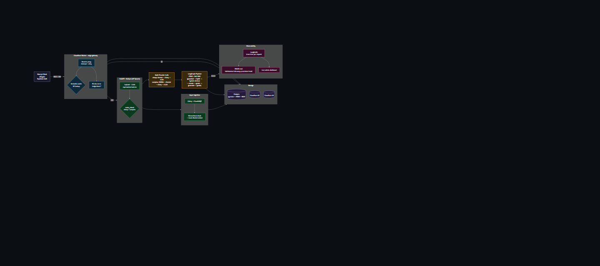

# 🚀 Thotqen: Production-Grade Conversational RAG Engine

A highly optimized, production-ready Retrieval-Augmented Generation (RAG) system built to solve the real-world trade-offs of latency, cost, and retrieval accuracy. Engineered with a hybrid storage layer, stateful agentic flows, and multi-model routing.



Full breakdown — including the detailed CRAG/Self-RAG pipeline diagram — in [ARCHITECTURE.md](ARCHITECTURE.md).

---

## ⚡ Architectural Highlights & Production-Grade Decoupling

Unlike basic "tutorial-grade" RAG systems, **Thotqen** implements advanced optimization patterns to handle production scale:

### 1. Stateful Self-RAG & CRAG Graph ([langgraph_rag.py](file:///home/ayush/.dev/bbygrl/thotqen/app/services/langgraph_rag.py))
Built on **LangGraph**, the pipeline manages a complex routing topology that incorporates:
*   **Input Guardrails:** Early classification to block prompt injection and toxic queries.
*   **HyDE (Hypothetical Document Embeddings):** Generates hypothetical answers to bridge the semantic gap between questions and document chunks.
*   **Corrective RAG (CRAG) Fallback:** Integrates live web search (Tavily/DuckDuckGo) when the local knowledge base yields insufficient document scores.
*   **Self-RAG Loops:** Evaluates generated answers for hallucinations (groundedness) and query alignment (usefulness), triggering automatic query-rewrites if thresholds aren't met.

### 2. Hierarchical (Parent-Child) Chunking ([chunking.py](file:///home/ayush/.dev/bbygrl/thotqen/app/services/chunking.py))
*   **The Problem:** Large chunks dilute semantic vector representation. Tiny chunks lack the context necessary for an LLM to generate high-quality answers.
*   **The Solution:** Thotqen indexes **300-character child chunks** for high-precision vector search, but resolves them back to **1500-character parent chunks** in SQL before feeding them to the generation LLM.

### 3. PostgreSQL Hybrid Search with Reciprocal Rank Fusion (RRF) ([20260713_advanced_rag_schema.sql](file:///home/ayush/.dev/bbygrl/thotqen/supabase/migrations/20260713_advanced_rag_schema.sql))
Uses a custom database-level function `hybrid_search()` to run:
*   **Dense Retrieval:** HNSW vector similarity search on `pgvector`.
*   **Sparse Retrieval:** Full-text keyword matching using PostgreSQL `tsvector` with a GIN index.
*   **Fusion:** Fuses ranks using the **RRF formula** ($Score = \sum \frac{1}{60 + rank}$), catching exact terms (codes, IDs) and semantic meaning without needing complex score-normalization.

### 4. Intent Routing ([rag.py](file:///home/ayush/.dev/bbygrl/thotqen/app/services/rag.py))
*   Routes incoming queries through a cheap classifier (`llama-3.1-8b-instant`).
*   **Cheap/Factual Queries** are handled by high-throughput models: `gemini-2.5-flash` → Groq Llama 3.1 8B → self-hosted vLLM (PagedAttention) fallback.
*   **Complex/Reasoning Queries** are routed to `meta/llama-3.1-70b-instruct` (Nvidia API) → `gemini-2.5-pro` → Groq Llama 3.3 70B → vLLM fallback. This reduces average API costs by up to 80%.
*   Every LLM call in the graph retries with exponential backoff on transient timeouts/rate-limits (tenacity), and every node is traced in LangSmith as a named span.

### 5. Local BGE Reranking
*   Employs a local `BAAI/bge-reranker-base` cross-encoder to evaluate the retrieved document list.
*   Trims down the document pool to the top 5 most highly correlated contexts, minimizing the LLM context window and preventing "lost in the middle" retrieval degradation.

### 6. Asynchronous Background Ingestion
*   Decoupled ingestion pipeline using **Celery** + Redis/CloudAMQP.
*   Large file processing, parsing, hierarchical chunking, and embedding generation are run asynchronously, reporting real-time progress to the client via Server-Sent Events (SSE).

### 7. Evaluation Suite ([generate_testset.py](file:///home/ayush/.dev/bbygrl/thotqen/scripts/generate_testset.py) + [run_evals.py](file:///home/ayush/.dev/bbygrl/thotqen/scripts/run_evals.py))
*   Offline evaluation using the **RAGAS** framework: a synthetic testset is generated from real ingested documents, run through the live LangGraph pipeline, and scored by an LLM judge.
*   Metrics: `faithfulness` (hallucination detection), `answer_relevancy`, `context_precision`, `context_recall`.
*   Used as a regression gate, not a fabricated improvement claim — rerun after any retrieval/reranking/prompt change and diff against the last snapshot.

### 8. Full LangSmith Observability
*   Every node in the LangGraph pipeline (`input_guardrail`, `hyde_generator`, `retrieve`, `rerank_documents`, `grade_documents`, `web_search`, `generate`, `grade_generation`) carries a named `@traceable` span, so a full request renders as one readable trace tree.
*   `GET /api/admin/metrics` queries the LangSmith API directly (`total_runs`, `success_rate`, `avg_latency_ms`, `total_tokens`, recent trace activity) — a live admin dashboard, not static numbers.

---

## 🛠️ Stack & Infrastructure
*   **Framework:** FastAPI (Python)
*   **Orchestration & Workflow:** LangGraph, Celery
*   **Vector Database:** Supabase PostgreSQL with `pgvector` & HNSW indexing
*   **Embeddings:** Local SentenceTransformers (`all-MiniLM-L6-v2` / 384-dim)
*   **LLMs:** Gemini 2.5 (Flash/Pro), Llama 3.x (Groq & NVIDIA AI Endpoints), self-hosted vLLM (PagedAttention) as the no-API-key fallback
*   **Observability:** LangSmith (full tracing), RAGAS (offline eval)
*   **Hosting:** Dockerized deployment optimized for Hugging Face Spaces

---

## 📝 Environment Setup
Ensure the following keys are set in your `.env` file or hosting provider's variables:
```bash
DATABASE_URL=postgresql://...
SECRET_KEY=your_auth_secret
GROQ_API_KEY=gsk_...
GEMINI_API_KEY=AIzaSy...
NVIDIA_API_KEY=nvapi-...
TAVILY_API_KEY=tvly-...
LANGSMITH_TRACING=true
LANGSMITH_API_KEY=lsv2_pt_...
LANGSMITH_PROJECT=your-project-name
VLLM_BASE_URL=http://localhost:8001/v1   # optional — self-hosted fallback
```